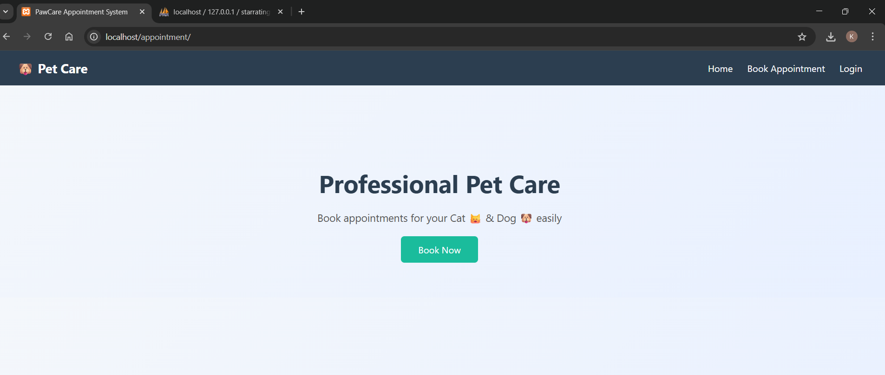
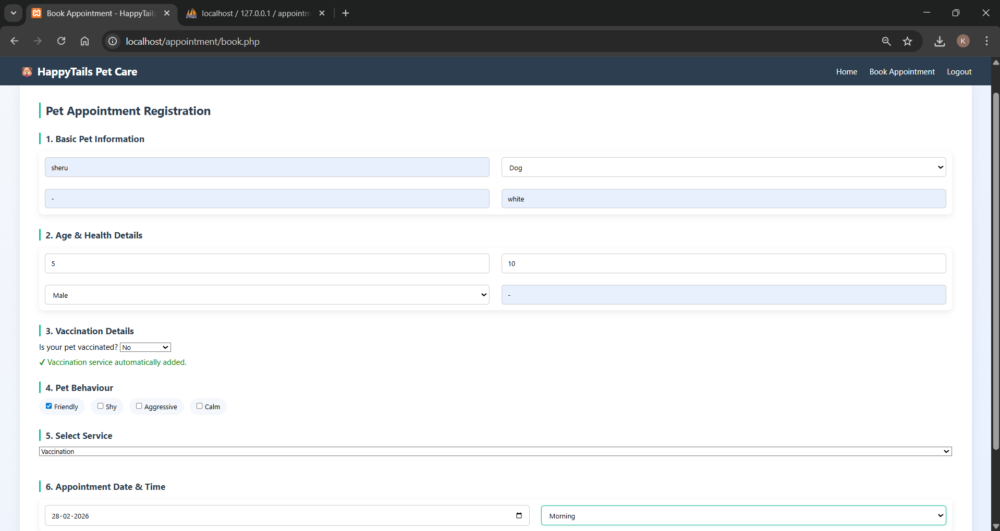
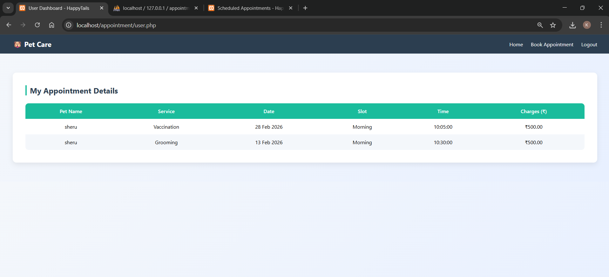
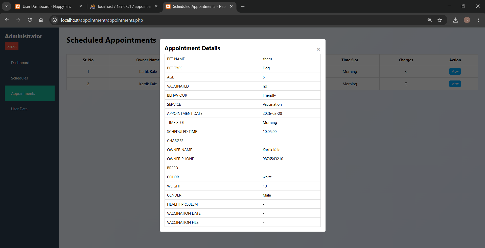
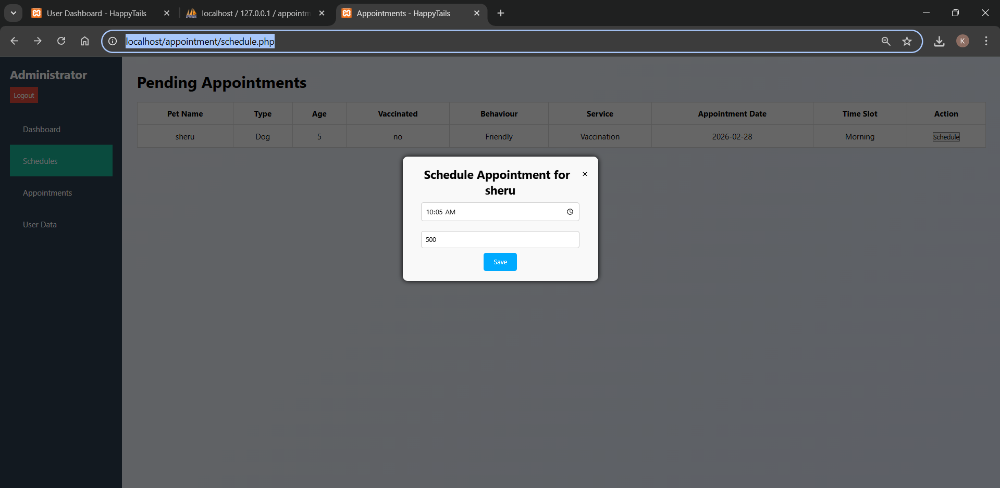

# Pet Appointment Booking System

## Overview

The **Pet Appointment Booking System** is a full-stack web application developed to streamline the process of scheduling and managing pet appointments. The system provides an intuitive interface for users to book appointments online, while offering administrators a dedicated dashboard to manage appointment requests, update appointment statuses, and monitor booking records.

The application is built using **PHP** and **MySQL** for backend processing and database management, while **HTML5**, **CSS3**, **Bootstrap**, and **JavaScript** are used to create a responsive and user-friendly frontend. The project demonstrates practical implementation of CRUD operations, session-based authentication, database integration, and workflow management in a web application.

---

# Features

## User Module

* User registration and login
* Online pet appointment booking
* Responsive appointment registration form
* View scheduled appointments
* Track appointment status
* Client-side form validation
* User dashboard for appointment management

---

## Administrator Module

* Secure administrator login
* Dashboard for appointment management
* View all appointment requests
* Schedule appointments
* Update appointment status
* Manage appointment workflow
* Monitor appointment records

---

# Technology Stack

## Frontend

* HTML5
* CSS3
* Bootstrap
* JavaScript

## Backend

* PHP

## Database

* MySQL

## Development Tools

* Visual Studio Code
* XAMPP
* phpMyAdmin

---

# System Architecture

```text
Client (Browser)
        │
        ▼
HTML • CSS • Bootstrap • JavaScript
        │
        ▼
            PHP
        │
        ▼
      MySQL Database
```

---

# Core Functionalities

### User Authentication

* User Registration
* User Login
* Session Management
* Secure Logout

### Appointment Management

* Book Appointment
* View Appointment Details
* Appointment Status Tracking
* Schedule Management

### Administrator Functions

* Administrator Login
* View Appointment Requests
* Schedule Appointments
* Manage Appointment Records
* Update Appointment Status

---

# Database Operations

The system performs the following database operations:

| Operation | Description                              |
| --------- | ---------------------------------------- |
| INSERT    | Store user and appointment details       |
| SELECT    | Retrieve appointment records             |
| UPDATE    | Update appointment status and schedule   |
| DELETE    | Remove appointment records when required |

---

# Security Features

* Session-based authentication
* Input validation
* Client-side form validation using JavaScript
* Protected administrator access
* Controlled appointment workflow

---

# Project Structure

```text
Pet-Appointment-Booking-System/
│
├── screenshots/
│   ├── index.png
│   ├── Appointment_Registration.png
│   ├── User_Dashboard.png
│   ├── Appointments_Details.png
│   └── Admin_Schedule_Appointment.png
│
├── admin-dashboard.php
├── admin-login.php
├── admin-logout.php
├── appointment.php
├── appointment.sql
├── book.php
├── index.php
├── login.php
├── README.md
├── Reconfig.php
├── register.php
├── schedule.php
├── script.js
├── style.css
├── user.php
├── user_info.php
└── user_logout.php
```

---

# Installation

## Prerequisites

* PHP 8.0 or above
* MySQL
* XAMPP
* Modern Web Browser

---

## Setup Instructions

### 1. Clone the Repository

```bash
git clone https://github.com/your-username/Pet-Appointment-Booking-System.git
```

### 2. Move the Project

Copy the project folder into the **htdocs** directory.

```text
xampp/
└── htdocs/
    └── Pet-Appointment-Booking-System/
```

### 3. Start XAMPP

Start the following services:

* Apache
* MySQL

### 4. Import the Database

* Open **phpMyAdmin**
* Create a new database
* Import the `appointment.sql` file

### 5. Configure Database

Update your database credentials in:

```text
Reconfig.php
```

### 6. Run the Application

```text
http://localhost/Pet-Appointment-Booking-System/
```

---

# Default Administrator Credentials

Use the following credentials to access the administrator panel:

| Username | Password |
| -------- | -------- |
| admin    | admin123 |

> **Note:** These credentials are intended for demonstration and development purposes only. It is recommended to change the default password before deploying the application in a production environment.

---

# Application Workflow

```text
User Registration/Login
           │
           ▼
Book Pet Appointment
           │
           ▼
Appointment Stored in Database
           │
           ▼
Administrator Reviews Request
           │
     ┌─────┴─────┐
     ▼           ▼
Approve      Schedule Appointment
     │           │
     └─────┬─────┘
           ▼
Updated Appointment Status
           │
           ▼
Visible to User Dashboard
```

---

# Screenshots

## Home Page



---

## Appointment Registration



---

## User Dashboard



---

## Appointment Details



---

## Administrator Dashboard



---

# Future Enhancements

* Email notifications for appointment confirmation
* SMS appointment reminders
* Pet profile management
* Veterinary profile management
* Appointment cancellation and rescheduling
* Calendar-based appointment scheduling
* Search and filtering of appointments
* Dashboard analytics and reports
* Responsive mobile optimization
* REST API integration

---

# Learning Outcomes

This project demonstrates practical implementation of:

* Full Stack Web Development
* PHP Server-Side Programming
* MySQL Database Management
* CRUD Operations
* Session Management
* Authentication and Authorization
* Form Validation
* Responsive Web Design
* Database Connectivity
* Appointment Workflow Management

---

# Author

**Kartik Kale**

Computer Engineering Student

---

# License

This project is developed for educational and learning purposes. It may be used, modified, and extended for academic or personal projects.
